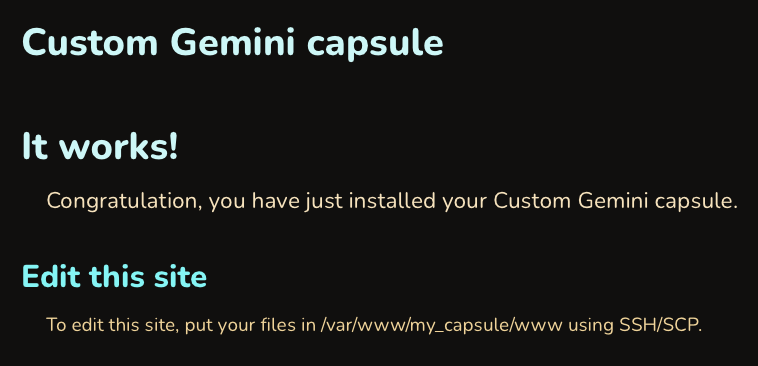
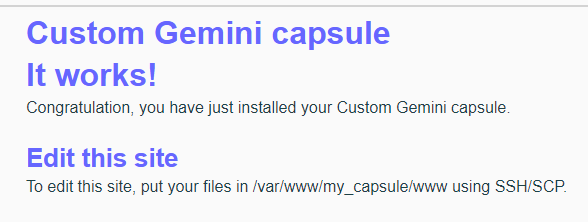

<!--
N.B.: This README was automatically generated by <https://github.com/YunoHost/apps_tools/blob/main/readme_generator>
It shall NOT be edited by hand.
-->

<h1>
  
  my_capsule, packaged for YunoHost
</h1>

Custom Gemini capsule with SFTP access and HtmGem

[](https://tildegit.org/Sbgodin/htmgem)
[](https://gmi.sbgodin.fr/htmgem/)
[?style=for-the-badge)](https://ci-apps.yunohost.org/ci/apps/my_capsule/)

<div align="center">
<a href="https://apps.yunohost.org/app/my_capsule"></a>
<a href="https://github.com/YunoHost-Apps/my_capsule_ynh/issues"></a>
</div>


## Screenshots



## 📦 Developer info

[](https://ci-apps.yunohost.org/ci/apps/my_capsule/)

🛠️ Upstream my_capsule repository: <https://tildegit.org/Sbgodin/htmgem>

Pull request are welcome and should target the [`testing` branch](https://github.com/YunoHost-Apps/my_capsule_ynh/tree/testing).

The `testing` branch can be tested using:
```
# fresh install:
sudo yunohost app install https://github.com/YunoHost-Apps/my_capsule_ynh/tree/testing

# upgrade an existing install:
sudo yunohost app upgrade my_capsule -u https://github.com/YunoHost-Apps/my_capsule_ynh/tree/testing
```

### 📚 App packaging documentation

Please see <https://doc.yunohost.org/packaging_apps> for more information.