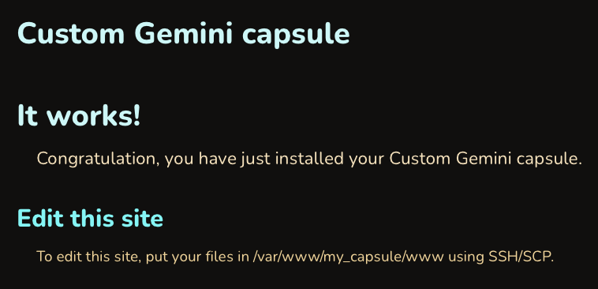

<!--
N.B.: README ini dibuat secara otomatis oleh <https://github.com/YunoHost/apps/tree/master/tools/readme_generator>
Ini TIDAK boleh diedit dengan tangan.
-->

# my_capsule untuk YunoHost

[](https://ci-apps.yunohost.org/ci/apps/my_capsule/)


[](https://install-app.yunohost.org/?app=my_capsule)

*[Baca README ini dengan bahasa yang lain.](./ALL_README.md)*

> *Paket ini memperbolehkan Anda untuk memasang my_capsule secara cepat dan mudah pada server YunoHost.*  
> *Bila Anda tidak mempunyai YunoHost, silakan berkonsultasi dengan [panduan](https://yunohost.org/install) untuk mempelajari bagaimana untuk memasangnya.*

## Ringkasan

Custom Gemini capsule with SFTP access and HtmGem to make your Gemini pages reachable on the web.


**Versi terkirim:** 1.4.1~ynh2

**Demo:** <https://gmi.sbgodin.fr/htmgem/>

## Tangkapan Layar




## Dokumentasi dan sumber daya

- Website aplikasi resmi: <https://tildegit.org/Sbgodin/htmgem>
- Depot kode aplikasi hulu: <https://tildegit.org/Sbgodin/htmgem>
- Gudang YunoHost: <https://apps.yunohost.org/app/my_capsule>
- Laporkan bug: <https://github.com/YunoHost-Apps/my_capsule_ynh/issues>

## Info developer

Silakan kirim pull request ke [`testing` branch](https://github.com/YunoHost-Apps/my_capsule_ynh/tree/testing).

Untuk mencoba branch `testing`, silakan dilanjutkan seperti:

```bash
sudo yunohost app install https://github.com/YunoHost-Apps/my_capsule_ynh/tree/testing --debug
atau
sudo yunohost app upgrade my_capsule -u https://github.com/YunoHost-Apps/my_capsule_ynh/tree/testing --debug
```

**Info lebih lanjut mengenai pemaketan aplikasi:** <https://yunohost.org/packaging_apps>
