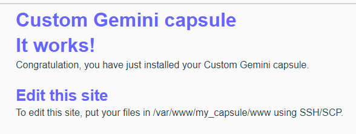

<!--
To README zostało automatycznie wygenerowane przez <https://github.com/YunoHost/apps/tree/master/tools/readme_generator>
Nie powinno być ono edytowane ręcznie.
-->

# my_capsule dla YunoHost

[](https://ci-apps.yunohost.org/ci/apps/my_capsule/)


[](https://install-app.yunohost.org/?app=my_capsule)

*[Przeczytaj plik README w innym języku.](./ALL_README.md)*

> *Ta aplikacja pozwala na szybką i prostą instalację my_capsule na serwerze YunoHost.*  
> *Jeżeli nie masz YunoHost zapoznaj się z [poradnikiem](https://yunohost.org/install) instalacji.*

## Przegląd

Custom Gemini capsule with SFTP access and HtmGem to make your Gemini pages reachable on the web.


**Dostarczona wersja:** 1.4.1~ynh2

**Demo:** <https://gmi.sbgodin.fr/htmgem/>

## Zrzuty ekranu




## Dokumentacja i zasoby

- Oficjalna strona aplikacji: <https://tildegit.org/Sbgodin/htmgem>
- Repozytorium z kodem źródłowym: <https://tildegit.org/Sbgodin/htmgem>
- Sklep YunoHost: <https://apps.yunohost.org/app/my_capsule>
- Zgłaszanie błędów: <https://github.com/YunoHost-Apps/my_capsule_ynh/issues>

## Informacje od twórców

Wyślij swój pull request do [gałęzi `testing`](https://github.com/YunoHost-Apps/my_capsule_ynh/tree/testing).

Aby wypróbować gałąź `testing` postępuj zgodnie z instrukcjami:

```bash
sudo yunohost app install https://github.com/YunoHost-Apps/my_capsule_ynh/tree/testing --debug
lub
sudo yunohost app upgrade my_capsule -u https://github.com/YunoHost-Apps/my_capsule_ynh/tree/testing --debug
```

**Więcej informacji o tworzeniu paczek aplikacji:** <https://yunohost.org/packaging_apps>
